## MQTTactic
The MQTTactic is our tool for evaluating the security of the MQTT Broker with static analyses. More details and instructions will be uploaded/updated later.


### 0x01 LLVM IR generation

We provide the detailed technical guidance and examples for LLVM IR generation online (https://github.com/MQTTactic/LLVM-IR-generation), which include environment configuration, all necessary commands to run the tool. The LLVM IR is the input of MQTTactic.

### 0x02 Getting started
#### 1. Install

*   LLVM

    The MQTTactic works on LLVM IR, So LLVM must be available in your system. Currently, We use LLVM-14 currently and build the tool with gcc-10/g++-10.

```
$ sudo apt install gcc-10 g++-10 python3 python3-distutils zlib1g-dev unzip cmake  nodejs ninja-build
```

1.  RELEASE version

```
$ wget https://github.com/llvm/llvm-project/releases/download/llvmorg-14.0.0/clang+llvm-14.0.0-x86_64-linux-gnu-ubuntu-18.04.tar.xz
$ tar xvf clang+llvm-14.0.0-x86_64-linux-gnu-ubuntu-18.04.tar.xz
$ export LLVM_DIR=/root/Document/clang+llvm-14.0.0-x86_64-linux-gnu-ubuntu-18.04
```

2.  DEBUG version

```
$ wget https://github.com/llvm/llvm-project/releases/download/llvmorg-14.0.0/llvm-project-14.0.0.src.tar.xz
$ tar xvf llvm-project-14.0.0.src.tar.xz && cd llvm-project-14.0.0.src/
$ cmake -S llvm -B build -G Ninja -DCMAKE_BUILD_TYPE=Debug -DLLVM_ENABLE_PROJECTS="clang;lld;llvm;libcxx;libcxxabi"
$ cd build && ninja
```


*   SVF

```
git clone https://github.com/SVF-tools/SVF.git
cd SVF && git checkout 925fb44a
export LLVM_DIR=/root/Document/clang+llvm-14.0.0-x86_64-linux-gnu-ubuntu-18.04
source ./build.sh
```


```
export MQTT_DIR=/root/Document/mqttactic/MQTTactic
export SVF_DIR=/root/Document/SVF
export SVF_BIN=$SVF_DIR/Release-build
export Z3_DIR=/root/node_modules/z3.obj
export LLVM_DIR=/root/Document/clang+llvm-14.0.0-x86_64-linux-gnu-ubuntu-18.04


export LD_LIBRARY_PATH=$LD_LIBRARY_PATH:$LLVM_DIR/lib:$SVF_BIN/svf-llvm/
export PATH=$PATH:$LLVM_DIR/bin:$Z3_DIR/bin:$SVF_BIN/bin
export CPLUS_INCLUDE_PATH=$LLVM_DIR/include:$SVF_DIR/include:$SVF_BIN/include:$Z3_DIR/include:$MQTT_DIR/Include
export C_INCLUDE_PATH=$LLVM_DIR/include:$SVF_DIR/include:$Z3_DIR/include:$Z3_DIR/include:$MQTT_DIR/Include
```


*   Cargo

```
$ curl --proto '=https' --tlsv1.2 -sSf https://sh.rustup.rs | sh
$ rustup default nightly-2022-08-02
```

*    spin

>$ git clone  https://github.com/nimble-code/Spin.git
>
>$ apt-get install flex bison
>
>$ cd Spin && make -j4
>
>$ cd Src
>
>$ ln -s ​\$(pwd)/spin /usr/bin/spin


*   Other dependencies

```
# Boolector
# Download and build Boolector
$ git clone https://github.com/boolector/boolector
$ cd boolector

# Download and build Lingeling
$ ./contrib/setup-lingeling.sh

# Download and build BTOR2Tools
$ ./contrib/setup-btor2tools.sh

# Build Boolector
$ ./configure.sh --shared && cd build && make && make install

$ export LD_LIBRARY_PATH=$LD_LIBRARY_PATH:{build/lib/}
```


* Docker Image
```
```


#### 2. Usage
* Configuration

	A simple example can be found in `Include/`.
* CFG analysis
```
$ cd src/CFGPass
$ make SCA
```

* Symbolic Execution
```
$ cd src/SymbolicExecution/ && cargo build
$ cp target/debug/SE ../../src/CFGPass/bin/
$ cd ../ && python3 runSE.py
```

* Model Check
```
$ cd src/ModelCheck
$ python3 parseTypes.py
$ python3 autoModel.py
$ bash ModelChecker.sh
```


### 0x03 Challenges in different languages

Here lie numerous challenges in employing static analysis to extract comprehensive control flow from LLVM IR. We will continuously update this space with the technical details of how we tackle them.

#### C/C++

-   [ ] Function Pointers
-   [ ] Virtual Function
-   [ ] Destructor Function

#### Golang

-   [ ] Function Pointers
-   [ ] Interface


### 0x04 Broker running configuration

See `{MQTTactic}/Broker Running Configurations`.


### 0x04 A running example

We use pre-defined (with one-time efforts) code templates of each *operation* $o$ to generate the Promela code for each Path Type $ept$. Specifically, each code template describes the  operation (`read`, `write` or `deliver`) performed on a particular state variable $v$. For example, $o_{will-read}$ indicates to read the *will* message from the client's session. Hence, the code template of $o_{will-read}$ is defined as shown in Listing 1. Notably, there are placeholders in the code templates (e.g., "{clientID}" in Listing 1), which will be populated with the actual values when MQTTactic constructs the *concrete model*.


Listing 1: $o_{deliver}$ code template
```c
msg = Sessions[{clientId}].willmessage
```

Taking the hmq broker as an example, we will illustrate how to translate one of the Effective Path Types (extracted by *SCA* module) for *DISCONNECT* action into Promela code.

#### **The $ept$ example of *disconnect* action**
As shown  below (Listing 2, 3, 4), the $ept$ contains 3 operations: $o_{will-read}$, $o_{sub-read}$ and $o_{deliver}$.


Listing 2: $o_{will-read}$ at *hmq\_sourcecode/broker/client.go:850*
```c
if c.info.willMsg != nil {
    //read will msg variable
    b.PublishMessage(c.info.willMsg)
}
```

Listing 3: $o_{sub-read}$ at *hmq\_sourcecode/broker/lib/topics/memtopics.go:82*
```c
// read subscription variable
return this.sroot.smatch(topic, qos, subs, qoss)
```


Listing 4: $o_{deliver}$ at *hmq\_sourcecode/broker/broker.go:669*
```c
for _, sub := range subs {
  s, ok := sub.(*subscription)
  if ok {
    // deliver the msg
    if err := s.client.WriterPacket(packet); err != nil {
      log.Error("write message error", zap.Error(err))
    }
  }
}
```

#### **Generating Promela codes for $ept$**
With the identified $ept$(s) for the actions, we now generate the Promela codes. Firstly, We show the pre-defined Promela code templates of these three operations as follows (Listing 1 for $o_{will-read}$, Listing 5 for $o_{deliver}$, Listing 6 for $o_{sub-read}$).


Listing 5: $o_{deliver}$ code template
```C
Deliver({msg}, {sess});
```

Listing 6: $o_{sub-read}$ code template
```C
bool hasSubscription = false;
j = 0;
// Traverse the subscription tree of {sess} and check if it is subscribed to the topic of message
do
  :: j < MAXSUBSCRIPTIONS ->
    if
      :: (Sessions[{sess}].subscriptions[j].topic == {msg}.topic) ->
        hasSubscription = true;
        break;
      :: else -> skip;
    fi;
    j = j + 1;
  :: else ->
    goto nextClients;
od;

nextClients:
  skip;
```

Listing 7: The model's skeleton code
```C
proctype ProcessSubscriber(short index){
  do
    ::
      atomic{
        // placeholders
        CONNECT_{placeholder}();
      }
    ::
      atomic{
        // placeholders
        DISCONNECT_{placeholder}();
      }
    ...
    :: else -> break;
  od;
}
...

init {
  ...
  run ProcessPublisher(0);   //Publisher client 1
  run ProcessSubscriber(1);  //Subscriber client 1
  run ProcessPublisher(2);   //Publisher client 2
}
```


Then, MQTTactic will assemble these code templates with the operation sequence of this $ept$ to generate a handler function in Promela code for the *DISCONNECT* action. The same process will be carried out for other actions and $ept$s. The placeholders in skeleton code (Listing 7) would then be populated with the above generated Promela functions to construct the *concrete model* in Promela.

Listing 8: Generated DISCONNECT function in Promela
```C
inline DISCONNECT(index){
  atomic{
    if
      :: Sessions[Clients[index].clientId].willmessage.topic != -1 ->
        msg = Sessions[Clients[index].clientId].willmessage;
        short i_1 = 0;
        do
          :: i_1 < MAXSESSIONS ->
            bool hasSubscription = false;
            j = 0;

            ...

            do
              :: j < MAXSUBSCRIPTIONS ->
                if
                  :: (Sessions[i_1].subscriptions[j].topic == msg.topic) ->
                    hasSubscription = true;
                    break;
                  :: else -> skip;
                fi;
                j = j + 1;
              :: else ->
                goto nextClients;
            od;
            if
              :: (hasSubscription == true && Sessions[i_1].connected == true) ->
                Deliver(msg, i_1);
              :: else -> skip;
            fi;

          ...

        od;
      :: else -> skip;
    fi;
  }
}
```

### 0x05 Proof of Concept (POC)

#### POC exploit on Flaw 1
<div class="my-class">
    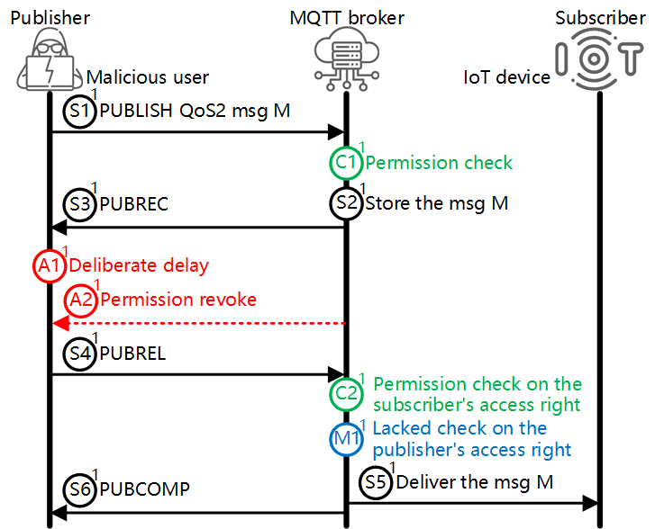
</div>

> $S_1$ -> $C_1$ -> $S_2$ -> $S_3$ -> $A_1$ -> $A_2$ -> $S_4$ -> $C_2$ -> $S_5$


To exploit the Flaw 1, we deployed the Mosquitto
broker in our testing server, used the popular MQTT client
[MQTTX](https://github.com/emqx/MQTTX) to simulate the victim smart door, and wrote
another malicious MQTT client to act as the malicious user,
which was programmed to stall after receiving the PUBREC
packet from the broker (i.e., stall at the step $S_3$) and to
continue the message processing under manual instruction.
To strike the POC attack, we first authorized the malicious
client with the right to PUBLISH message to the topic
that the MQTTX client (the smart door) subscribes to. Then,
we started the attack by sending an “unlock door” command
within a QoS 2 message to the broker. After the steps of
$S_1$ -> $C_1$ -> $S_2$ -> $S_3$ -> $A_1$, the malicious client stalls. We, then,
reconfigured the Mosquitto broker to remove the malicious
client's access right (step $A_2$), simulating the real-world
scenario where an Airbnb guest checks out and loses access
to the smart door. Next, we instructed the malicious client
to send the PUBREL packet (step $S_4$), which triggers the
following steps of $C_2$ -> $S_5$ -> $S_6$, and found that the smart
door was unlocked successfully after receiving the command
in the QoS 2 message M.

#### POC exploit on Flaw 2
<div>
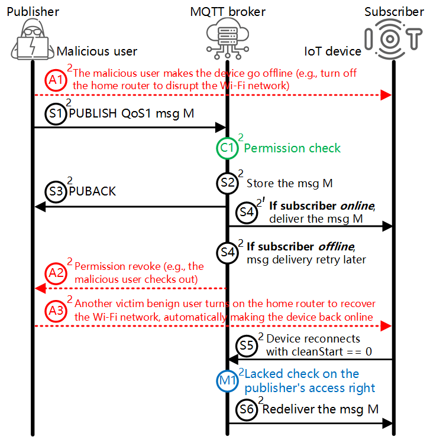
</div>

> $A_1$ -> $S_1$ -> $C_1$ -> $S_2$ -> $S_3$ -> $S_4$ -> $A_2$ -> $A_3$ -> $S_5$ -> $S_6$


We confirmed Flaw 2 is exploitable
in a smart home system and has a real-world impact. We
used Mosquitto and two MQTTX clients to simulate the
vulnerable MQTT broker, a malicious Airbnb guest, and the
victim smart backdoor, respectively. At first, we authorized
the malicious guest to control the smart backdoor, simulat-
ing that the guest possesses access right to the backdoor
during his stay. Then, we cut off the connection between
the smart backdoor and the broker ($A_1$), simulating that
the guest turns off the WiFi networ, which enforces the
smart backdoor to go offline. Then, we let the malicious
guest PUBLISH a QoS 1 message ($S_1$) containing an
“unlocking” command to the smart backdoor, which caused
the system to stall after executing the actions of $C_1$ -> $S_2$ -> $S_3$ -> $S_4$. We then reconfigured the Mosquitto to remove
the guest's access right, simulating that the guest checks
out and loses control of the smart backdoor ($A_2$). Later,
we recovered the connection between the smart backdoor
and the broker, simulating that a victim guest checks in
(e.g., from the front door) and turns on the WiFi network
($A_3$). At last, we found that the smart backdoor received
the “unlocking” command from the earlier QoS 1 message
after it reconnects to Mosquitto ($S_5$ -> $S_6$), indicating the
malicious guest was able to leverage Flaw 2 to unlock a
smart door that he was not entitled to control.

#### POC exploit on Flaw 3
<div>
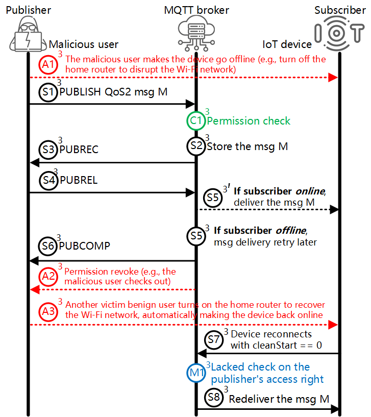
</div>

> $A_1$ -> $S_1$ -> $C_1$ -> $S_2$ -> $S_3$ -> $S_4$ -> $A_2$ -> $A_3$ -> $S_5$ -> $S_6$ -> $S_7$ -> $S_8$

Due to the “exactly once delivery” feature in QoS 2
messaging, if the target client is offline, the
broker would retry to deliver the message M to the client
when the client reconnects (i.e., $S_5$ -> $S_7$ -> $S_8$). However, we
found the delivery retry mechanism in QoS 2 has the same
problem of that in the QoS 1 messaging as elaborated in
the Flaw 2. The exploiting and mitigation to the Flaw
3 are also similar to that of the Flaw 2.


#### POC exploit on Flaw 4
<div>
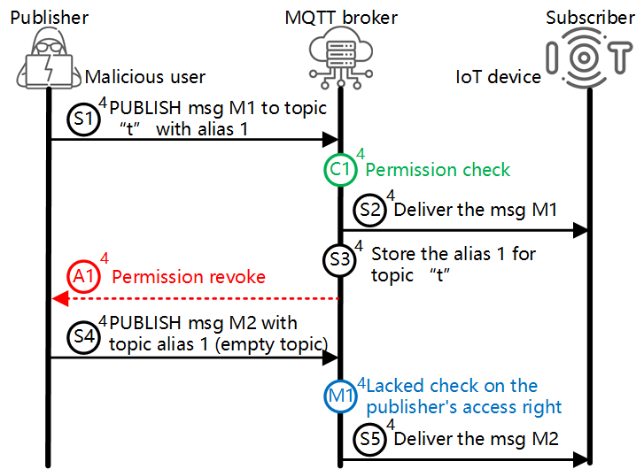
</div>

> $S_1$ -> $C_1$ -> $S_2$ -> $S_3$ -> $A_1$ -> $S_4$ -> $S_5$


We also confirmed Flaw 4 in a sim-
ulated smart home system containing the vulnerable broker
(VolantMQ) and two MQTTX clients (the malicious user
and the victim IoT device). First,
we used the [auth http plugin](https://gitlab.com/VolantMQ/vlplugin/auth/http) (used by VolantMQ for
authentication and authorization) to authorize the malicious
user to control the victim IoT device. Then, we used the
malicious MQTTX client to send a PUBLISH packet with
both topic name and topic alias, resulting in the
VolantMQ broker recording a mapping from the topic
name to topic alias ($S_1$ -> $C_1$ -> $S_2$ -> $S_3$). After that, we
revoked the permission from the malicious user ($A_1$), and
found that the IoT device could still receive the later mes-
sage sent by the unauthorized malicious user only with the
topic alias ($S_4$ -> $S_5$).

#### POC exploit on Flaw 5
<div>
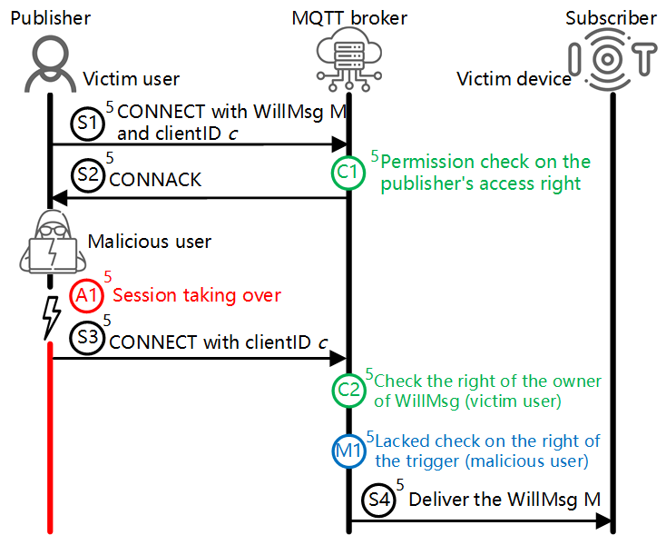
</div>

> $S_1$ -> $C_1$ -> $S_2$ -> $S_3$ -> $A_1$ -> $S_4$ -> $C_2$ -> $S_5$

As shown
in the Figure, we used the Mosquitto as the flawed broker
and three MQTTX clients as the victim user, the victim
device and the malicious user. First, we let the victim user
client, the Mosquitto broker and the victim device client to
communicate following the steps of $S_1$ -> $C_1$ -> $S_2$ -> $S_3$. Then,
we used the malicious user client to send a new CONNECT
packet using the victim user's clientID ($S_4$). Since the
following step $C_2$ checks the permission of the owner of
the Will message (the victim user), not the trigger (the
malicious user), the Mosquitto broker allowed the delivery
of the Will message ($S_4$).

#### POC exploit on Flaw 6
<div>
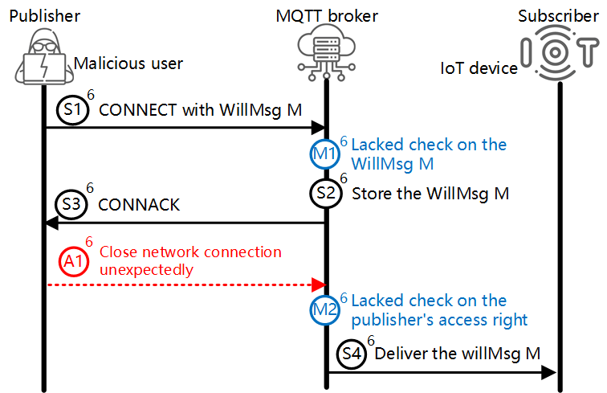
</div>

> $S_1$ -> $S_2$ -> $S_3$ -> $A_1$ -> $S_4$

We used
hmq as the vulnerable broker and two MQTTX clients to simulate the attacker and the victim device. We let the
victim client subscribes to the topic “smartdoor”. Then, we
used the attacker client to send to the broker a CONNECT
packet containing a Will message that carries a command
payload of “unlocking” and a topic of “smartdoor”. Note
that, we did not authorize the attacker client the access
right to the topic “smartdoor”. After we cut off the network
of the attacker client ($A_1$), the victim client received the
“unlocking” command successfully.

#### POC exploit on Flaw 7
<div>
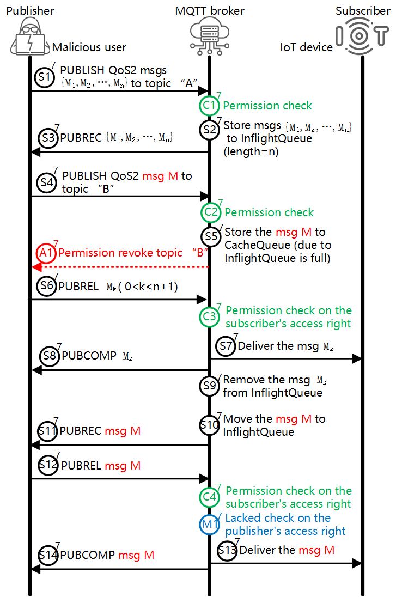
</div>

We confirmed Flaw 7 on Mosquitto
(capacity of InflightQueue n = 20 by default) following
the steps shown in the Figure — a malicious user, who
was authorized to control two IoT devices (associated with
topic A and B, respectively) at first, was able to control
the device B after his permission to control device B was
revoked.

#### Existing Flaws
> Y. Jia, L. Xing, Y. Mao, D. Zhao, X. Wang, S. Zhao, and Y. Zhang,"Burglars' IoT Paradise: Understanding and Mitigating Security Risks of General Messaging Protocols on IoT Clouds,” in Proceedings of the 41st IEEE Symposium on Security and Privacy, 2020, pp. 465–481.
>
Jia et al. identified several flaws in different commercial MQTT brokers through manual analyses, Among all the security flaws identified in [1], four of them are authorization-related flaws (our goal), which were also identified by MQTTactic, i.e., Flaw 8: Unauthorized subscription via ClientID hijacking; Flaw 9: Unauthorized trigger of the Retained message; Flaw 10: Un-updated subscription; Flaw 11: Unauthorized trigger of the Will message.


* **Flaw 8**
<div>
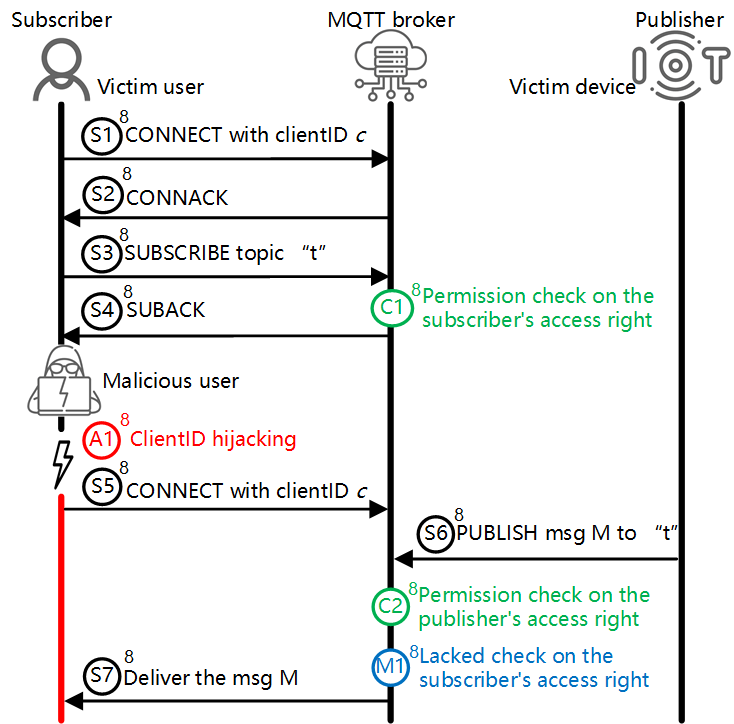
</div>

* **Flaw 9**
<div>
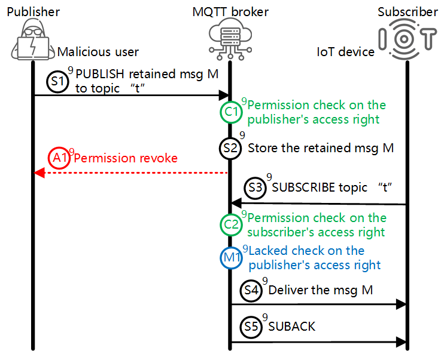
</div>

* **Flaw 10**
<div>
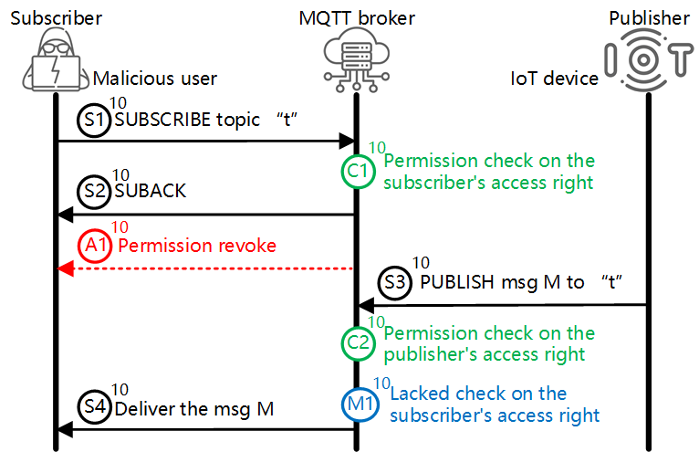
</div>

* **Flaw 11**
<div>
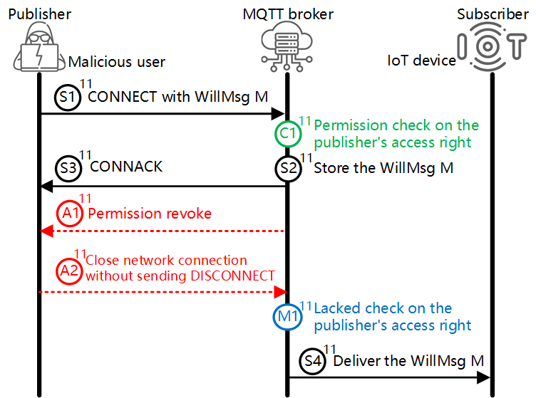
</div>
